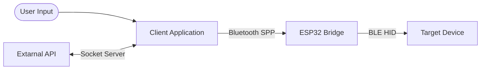

 <h1 align=center>Blue-clicker</h1>

A wireless macro and automation suite that lets you queue keystrokes and broadcast them as native BLE keyboard input to a secondary device.

[demo video here]

## Table of Contents

- [Key Features](#key-features)
- [Architecture & Data Flow](#architecture--data-flow)
    - [Component Breakdown](#component-breakdown)
    - [Data Flow](#data-flow)
    - [Tech Stack](#tech-stack)
- [Requirements & Installation](#requirements--installation)
    - [Requirements](#requirements)
        - [Hardware Requirements](#hardware-requirements)
        - [Software Requirements](#software-requirements)
    - [Instalation](#instalation)
        - [Client](#client)
        - [Firmware](#firmware)
- [Usage](#usage)
    - [Command palette](#command-palette)
    - [API](#api)
- [Roadmap](#roadmap)
- [Licence](#licence)

## Key Features

- Broadcast numbers, uppercase, and lowercase characters in their individual intervals. Prioritize them so the more important ones are typed first.
- Save and load frequently used setups as presets to quickly reuse them without reconfiguring each time.
- API designed to receive keystrokes from external programs.

## Architecture & Data Flow

This project bridges keys from a TUI on a primary device to a target device via an ESP32, supporting both user input through the UI and keys from other programs via an API.



### Component Breakdown

- Client Application (TUI): The project's control center. It provides a user interface to configure keys to send to the bridge. It also features an API Listener Mode, allowing external programs to send keys. When it receives a request, the client processes it, sends a response, and forwards the action.
- ESP32 Bridge: Hardware communication layer. Receives a payload from the client via Bluetooth SPP and converts it into BLE HID signals.
- Target Device: The ESP32-connected computer via BLE interprets incoming signals as keystrokes.

### Data Flow

1. Input Stage: Data comes either from user-defined keystrokes or from external programs via the API.
2. Transmision: The Client sends processed keystrokes to the ESP32 bridge over Bluetooth SPP.
3. Execution: The ESP32 collects data, emulates a keyboard, and sends the BLE HID keystrokes directly to the Target Device.

### Tech Stack

- Client Application: Python / Textual
- ESP32 Firmware: C / PlatformIO / ESP-IDF

## Requirements & Installation

### Requirements

#### Hardware Requirements

 - ESP32 board that supports Bluetooth Dual Mode.
 - Two Bluetooth-enabled devices.

#### Software Requirements

- Python 3.14.6 or higher
- PlatformIO Core, version 6.2.0
- ESP-IDF 6.12.0 

### Instalation

#### Client

1. Navigate to the client directory:
```bash
cd client
```

2. Install dependencies:
```bash
pip intall .
```

#### Firmware

1. Connect your ESP32 controller to your computer via USB.

2. Build and flash the firmware to your device:
```bash
pio run -t upload
```

3. Open the serial monitor to view runtime logs and debugging output:
```bash
pio run device monitor
```

## Usage

Make sure the controller is supplied with a steady 5V power source.

To get started, you need to ensure both the Primal (where the client will work) and Target (which receives keystrokes) devices have Bluetooth enabled and are paired with the controller.

> Pair Primal Device with "**ESP32_Key_Bridge**"<br>
> Pair Target Device with "**ESP32_Keyboard**".

Start the Client Application on the Primal Device:
```bash
cd client
python main.py
```

### Command palette

You can access the command palette while using the client either at the bottom right of the terminal or by pressing Ctrl+P. It includes default Textual commands plus suite features like Listening Mode, Load Preset, and Save Preset.

The command names clearly indicate that preset commands are intended to save and load frequently used setups.

### API

Listening Mode moves you to the Listening Screen, where requests are received via a socket. Be aware that all current keys will be cleared when you switch screens.

External programs can connect by the following endpoint:

`127.0.0.1:8888`

**Expected JSON Data Format:**
```json
{
    "action": "press",
    "payload": "f"
}
```
**Data Elements**
- `action`: What needs to be done with a payload.
- `payload`: Numbers, uppercase and lowercase characters.

**Action Types**
- `press`: Press a key.
- `hold`: Hold a key.
- `release`: Release a held key.

## Roadmap

- Broadcast special characters (.,?!=-+).
- Mouse support for external programs.

## Licence