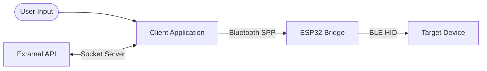

<h1 align=center>Blue-clicker</h1>

A wireless macro and automation suite that lets you queue keystrokes and broadcast them as native BLE keyboard input to a secondary device.

[demo video here]

## Table of Contents

- [Key Features](#key-features)
- [Architecture & Data Flow](#architecture--data-flow)
    - [Component Breakdown](#component-breakdown)
    - [Data Flow](#data-flow)
    - [Tech Stack](#tech-stack)
- [Requirements & Installation](#requirements--installation)
    - [Requirements](#requirements)
        - [Hardware Requirements](#hardware-requirements)
        - [Software Requirements](#software-requirements)
    - [Instalation](#instalation)
- [Usage](#usage)
- [Licence](#licence)

## Key Features

- Broadcast numbers, uppercase, and lowercase characters in their individual intervals. Prioritize them so the more important ones are typed first.
- Save and load frequently used setups as presets to quickly reuse them without reconfiguring each time.
- API designed to receive keystrokes from external programs.

## Architecture & Data Flow

This project bridges keys from a TUI on a primary device to a target device via an ESP32, supporting both user input through the UI and keys from other programs via an API.

### Component Breakdown

- Client Application (TUI): The project's control center. It provides a user interface to configure keys to send to the bridge. It also features an API Listener Mode, allowing external programs to send keys. When it receives a request, the client processes it, sends a response, and forwards the action.
- ESP32 Bridge: Hardware communication layer. Receives a payload from the client via Bluetooth SPP and converts it into BLE HID signals.
- Target Device: The ESP32-connected computer via BLE interprets incoming signals as keystrokes.

### Data Flow

1. Input Stage: Data comes either from user-defined keystrokes or from external programs via the API.
2. Transmision: The Client sends processed keystrokes to the ESP32 bridge over Bluetooth SPP.
3. Execution: The ESP32 collects data, emulates a keyboard, and sends the BLE HID keystrokes directly to the Target Device.

### Tech Stack

- Client Application: Python / Textual
- ESP32 Firmware: C / ESP-IDF

## Requirements & Installation

### Requirements

#### Hardware Requirements

 - ESP32 board that supports Bluetooth Dual Mode.
 - Two Bluetooth-enabled devices.

#### Software Requirements

- Python 3.14.6 or higher
- ESP-IDF 6.12.0

### Instalation

#### Client

#### Firmware

## Usage

## Licence